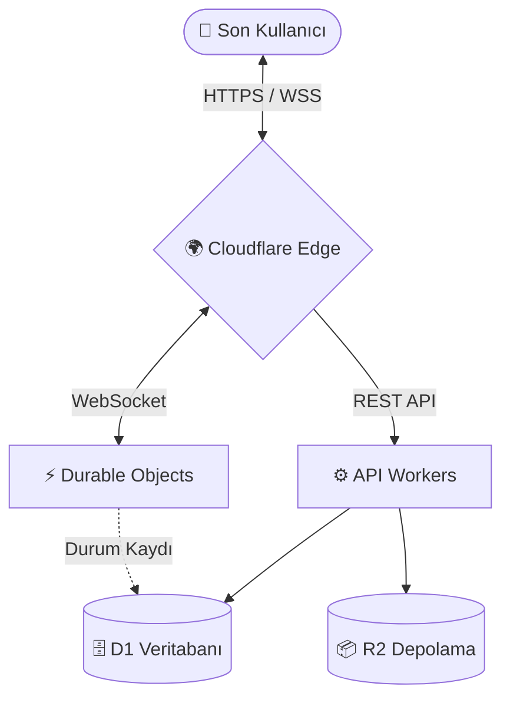

<div align="center">

# 🦉 BAYKUŞ PLATFORMU (Eğitim Sürümü)
### Yeni Nesil, Sunucusuz (Serverless) Topluluk İletişim Altyapısı


<p>
  <strong>Baykuş</strong>, akademik bir çalışma kapsamında Cloudflare Edge ağının gücünü kullanarak geliştirilmiş; 
  ölçeklenebilir, düşük gecikmeli ve yüksek performanslı bir gerçek zamanlı sohbet ekosistemi prototipidir.
</p>

[Özellikler](#-temel-özellikler) • [Mimari](#-sistem-mimarisi) • [Teknoloji Yığını](#-teknoloji-yığını)

</div>

---

## 📖 Proje Hakkında

Bu proje, **Serverless (Sunucusuz)** ve **Edge Computing (Uç Bilişim)** mimarilerinin modern web uygulamalarındaki kullanımını incelemek ve uygulamak amacıyla geliştirilmiştir. Geleneksel monolitik sunucu yapılarına alternatif olarak tasarlanan Baykuş, kullanıcılarına her zaman en yakın veri merkezinden hizmet vererek düşük gecikme süreleri (low latency) hedefler.

## 🧱 Sistem Mimarisi

Proje, yük dağılımını optimize etmek ve veriyi uç noktalarda işlemek üzerine kurgulanmış modern bir mimariye sahiptir.



## ✨ Temel Özellikler

### 🔌 Gerçek Zamanlı İletişim (Realtime)

* **Global WebSocket Ağı:** Durable Objects teknolojisi ile her kanal için izole edilmiş veri akışı yönetimi.
* **Canlı Durum (Presence):** Kullanıcıların "Çevrimiçi", "Rahatsız Etmeyin" gibi durumlarının anlık takibi.
* **Typing Indicators:** "Yazıyor..." bilgisinin anlık iletimi.

### 🏰 Topluluk Yönetimi

* **Sunucu & Kanal Yapısı:** Dinamik sunucu oluşturma ve kanal kategorizasyonu.
* **İzin Sistemi:** Bitwise (Bit düzeyinde) operatörler kullanılarak hesaplanan performanslı rol ve yetki hiyerarşisi.
* **Moderasyon:** Temel moderasyon araçları (Kick, Ban, Timeout) ve denetim kayıtları.

### 🛡️ Güvenlik & Performans

* **Veri Güvenliği:** SQL Injection saldırılarına karşı D1 Binding ve Prepared Statements (Parametrik Sorgu) yapısı.
* **DDOS Koruması:** Cloudflare altyapısı sayesinde doğal ağ koruması.

## 🛠 Teknoloji Yığını

| Alan | Teknoloji | Kullanım Amacı |
| --- | --- | --- |
| **Dil** | TypeScript | Tip güvenliği ve ölçeklenebilir kod yapısı. |
| **Runtime** | Cloudflare Workers | API Endpoint'leri ve iş mantığı. |
| **Veritabanı** | Cloudflare D1 | İlişkisel veri ve sorgulama (SQLite). |
| **State** | Durable Objects | WebSocket yönetimi ve anlık veri tutarlılığı. |
| **Depolama** | R2 | Profil resimleri ve medya dosyaları. |
| **Deployment** | Wrangler CLI | Geliştirme, test ve dağıtım aracı. |

## 👥 Geliştirici

Bu proje, akademik çalışma kapsamında tasarlanmış ve kodlanmıştır:

* **Memet Bilir** - *Geliştirici* - ([GitHub Profili](https://github.com/B1l1r)) 
* **Enes CAn Adil** - *Geliştirici* - ([GitHub Profili](https://github.com/c4nng))

## 📜 Lisans

Bu proje, eğitim ve öğrenim amaçlı paylaşıma açık olması adına **MIT Lisansı** ile lisanslanmıştır.
Kullanım, dağıtım ve katkı şartları için `LICENSE` dosyasına göz atabilirsiniz.

---

<div align="center">
<sub>Built with ❤️ using Cloudflare Stack</sub>
</div>

```

```